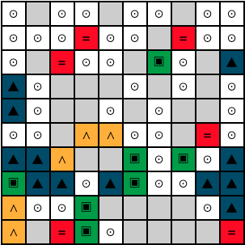

# grid

Make printable grid images with an underlying symbol layer.  Tooling for the [MIND Lab](https://www.science.smith.edu/mindindevelopmentlab/).

You can try it [here](https://foundling.github.io/pegboard)!
